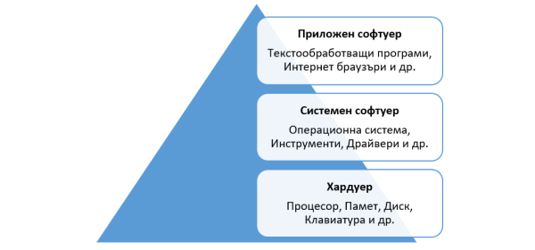

## Какво е системно програмиране?

**Системното програмиране** е дисциплина, която се занимава с разработката на **системен софтуер**. Характерно за системния софтуер е, че обикновено той взаимодейства пряко с хардуера и системните библиотеки на ядрото на операционната система (ОС) и служи за платформа на други приложения, които в повечето случаи се използват от крайния потребител (приложен софтуер). 
 
 
 
Операционните системи, могат също да се разглеждат като системен софтуер, тъй като на практика те управляват всички други програми и ресурси. Други примери са системни драйвери, шелл (shell), текстов редактор (text editor), компилатор (compiler) и дебъгер (debugger), инструменти (tools) и демони (daemons) на операционната система. Понякога един програмен продукт може да се разглежда като приложен и системен софтуер. Системите за бази данни изпълняват системни функции за други програми, но предлагат и инструменти, използвани в ежедневната работа на системни оператори, анализатори на данни. В операционната система Линукс, **системните инструменти** обикновено се намират в директориите **/sbin** и **/usr/sbin**. От **системните програмисти** се изисква да имат добра представа за хардуера и ОС, за да използват правилно и оптимално ресурсите на системата.
