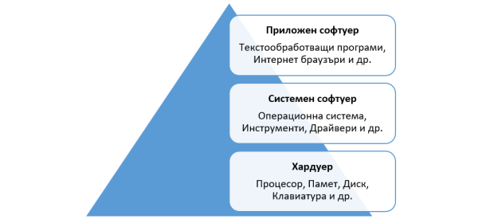

## What is system programming?

**System programming** is a discipline that deals with the development of **system software**. The characteristic of system software is that it usually interacts directly with the hardware and system libraries of the **kernel** of the operating system and serves as a platform for other applications, which in most cases are used by the end user or so-called **applied software**.

 

Operating systems can also be regarded as system software, as they essentially manage all other programs and resources. Other examples include **system drivers**, **shell**, **text editor**, **compiler**, **debugger**, **tools** and **daemons**.

Sometimes a software product can be viewed as both application and system software. Database systems perform system functions for other programs but also offer tools used in the daily work of system operators and data analysts.

In Linux, **system tools** are typically located in the directories **/sbin** and **/usr/sbin**.

**System programmers** are required to have a good understanding of hardware and operating systems in order to use the system's resources correctly and optimally.