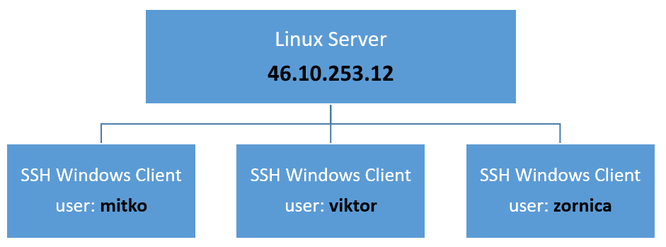

## Работна среда

Работната среда се състои от един Линукс сървър с реален Интернет протокол адрес **46.10.253.12** и множество Windows клиенти. Достъпа на клиентите до сървъра се осъществява посредством [Telnet](https://en.wikipedia.org/wiki/Telnet)  използвайки [SSH](https://bg.wikipedia.org/wiki/SSH ).
 
  
 
Telnet е разработен през 1969 г., като се започне с [RFC 15](https://tools.ietf.org/html/rfc15), разширен в [RFC 854](https://tools.ietf.org/html/rfc854) и стандартизиран като интернет стандарт [STD 8](https://en.wikipedia.org/wiki/STD_8)  на  [Internet Engineering Task Force](https://en.wikipedia.org/wiki/Internet_Engineering_Task_Force), един от първите интернет стандарти. Telnet осигурява достъп до интерфейс на командния ред на отдалечен хост до мрежови устройства и/или операционни системи. Поради сериозните опасения за сигурността при използването на Telnet през отворена мрежа като Интернет, използването му за тази цел значително намаля в полза на SSH.

SSH използва криптография с публичен ключ, за да удостовери отдалечения компютър и да му позволи да удостовери потребителя, ако е необходимо. Протоколът обикновено се използва за влизане в отдалечена машина и изпълнение на команди. Той може да прехвърля файлове, като използва свързаните протоколи за прехвърляне на файлове (SFTP) или защитени копия (SCP).
 
Системният софтуер включва **шелл** (_Термин на Английски език: Shell_), **текстов редактор** (_Термин на Английски език: Text editor_), **компилатор** (_Термин на Английски език: Compiler_) и **дебъгер** (_Термин на Английски език: Debugger_), **инструменти** (_Термин на Английски език: Tools_) и **демони** (_Термин на Английски език: Daemons_) на операционната система. 
