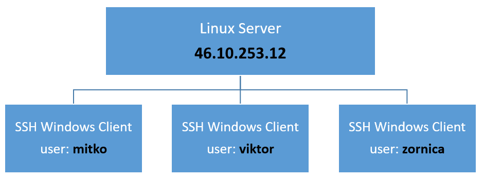

## Working Environment

The work environment consists of a Linux server with a real Internet Protocol address **46.10.253.12** and multiple Windows clients. Client access to the server is realized via [Telnet](https://en.wikipedia.org/wiki/Telnet) using [SSH](https://bg.wikipedia.org/wiki/SSH).

  
 
Telnet was developed in 1969, starting with [RFC 15](https://tools.ietf.org/html/rfc15), expanded in [RFC 854](https://tools.ietf.org/html/rfc854), and standardized as an internet standard [STD 8](https://en.wikipedia.org/wiki/STD_8) by the [Internet Engineering Task Force](https://en.wikipedia.org/wiki/Internet_Engineering_Task_Force), one of the first internet standards. Telnet provides access to a command-line interface on a remote host to networking devices and/or operating systems. Due to serious security concerns when using Telnet over an open network like the Internet, its use for this purpose has significantly decreased in favor of SSH.

SSH uses public key cryptography to authenticate the remote computer and to allow it to authenticate the user if necessary. The protocol is commonly used to log into a remote machine and execute commands. It can transfer files using related file transfer protocols (SFTP) or secure copies (SCP).

The system software of the operating system includes: **shell**, **text editor**, **compiler**,  **debugger**, **tools** and **daemons**.
