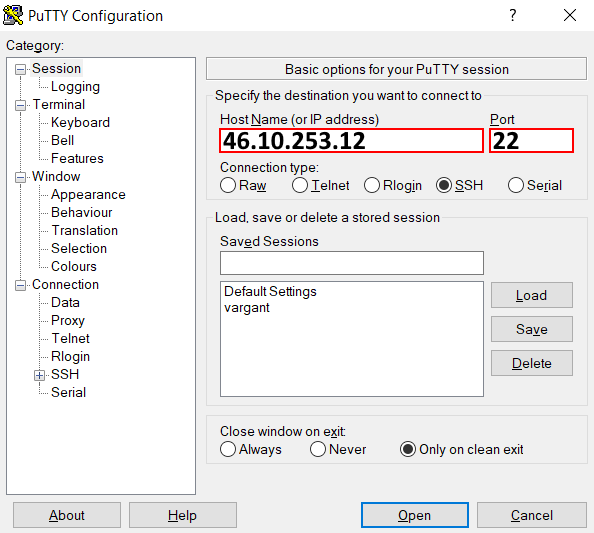

## Oтдалечен достъп

За осъществяване на отдалечен достъп до сървъра се изполва програмата **PuTTY**, която се разпространява като софтуер с отворен код и може да бъде изтеглена безплатно от Интернет на адрес: https://putty.org/ 
  
 