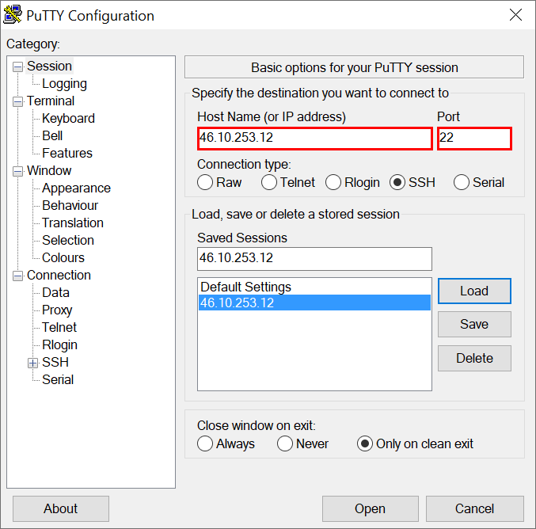

## Remote Access

To establish remote access to the server, the program **PuTTY** is used, which is distributed as open-source software and can be downloaded for free from the Internet at the following address: https://putty.org/ 
  
 