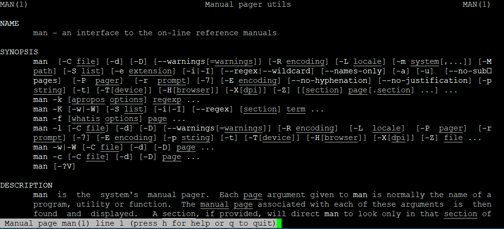

## How to get help in Linux?

Most system applications and commands that run in console mode in the Linux operating system have accompanying documentation in the form of **manual pages**. To access them, you can use the **man** program, with the following format:

```
man <command>
```

where *<command>* is the name of the application for which you want to get information. 
If a manual exists for the selected command, man will print the first page on the screen and provide the user with means to navigate the rest. You can see a detailed description of the functions with the following command:

```
man man
```

  

The important keys that you can use while working in the program are **PgUp** for scrolling up a page, **PgDn** for scrolling down a page, and the **q** key for exit.