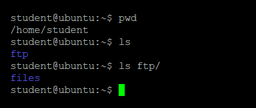
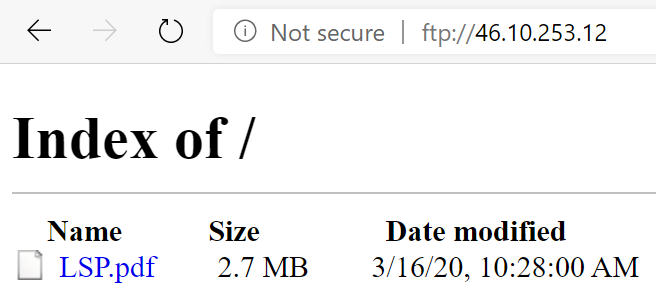

## Трансфер на файлове

Операционната система Линукс предоставя различни средства за прехвърляне на информация между компютри. Обикновено се използва моделът "клиент-сървър", при който клиентите инициират връзки и запитвания към сървър, който съответно отговаря на получените заявки.

В нашата работна среда използваме протоколът за трансфер на файлове [File Transfer Protocol](https://bg.wikipedia.org/wiki/FTP). Това е стандартен мрежов протокол, използван за прехвърляне на компютърни файлове между клиент и сървър в компютърна мрежа. Можете да копирате файлове в директорията `~/ftp/files` локално, на Вашата работна система: 

  

Достъп до тези файлове можете да получите с всеки Интернет браузър, като се свържете с адреса на учебния сървър и се идентифицирате с Вашето потребителско име и парола за достъп:

   

Също така можете да управлявате файловете от Вашата папка ~/ftp/files с всеки един клиент поддържащ протокола FTP (Например: програмата [FileZilla](https://filezilla-project.org/download.php)).
