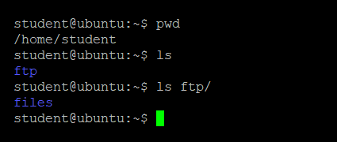
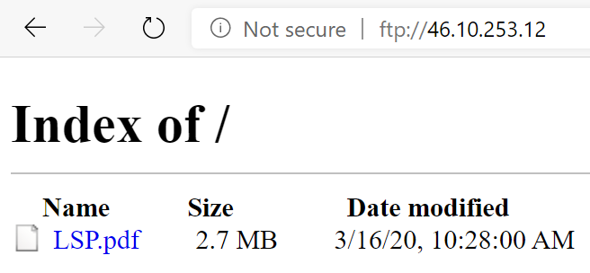

## File Transfer Protocol

The operating system provides various tools for transferring information between computers. 
Typically, the 'client-server' model is used, where clients initiate connections and requests to a server, which responds to them.

We use the [File Transfer Protocol](https://en.wikipedia.org/wiki/FTP). 
It is a standard network protocol for transferring files between a client and a server in a computer network. 
You can copy files locally to your folder:

  

You can access these files with any Internet browser by visiting the address of the work server and identifying yourself with a username and access password:

   

You can manage the files from your folder with any client that supports the FTP protocol.
(For example: [FileZilla](https://filezilla-project.org/download.php)).
