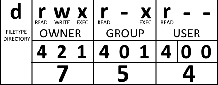
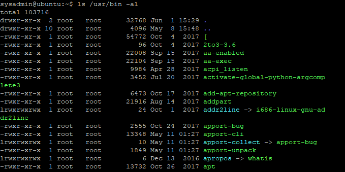

## File Permissions

Traditional file systems support three **modes** for file usage: **read**, **write** and **execute**. 

On the other hand, every file in Linux belongs to a **user** and a **group**, which by default, are the creator of the file and their primary group. 
Based on this, three **levels** of access rights for file operations are defined: **owner**, **group** and **public**. 

By combining the three levels and the three modes, 9 possible characteristics of files are obtained, which can be presented with the following bitmask (_the first flag indicates whether the field describes a directory or a file_):



In the above example, the file owner has full rights over the file, the members of the file's group have read and execute rights, and all other users have only read rights.

In the console mode of Linux, we can view the rights of the elements in the current directory using the command:

```
ls -la
```

  

In Linux, there are defined additional special modes for files and directories. One of these modes is **SUID** (short for: Set-User IDentification), which is identified in the permissions mask with `(s)` instead of `(x)` at the owner level. When a file with executable code is in this mode and is executed, the created processes and resources will belong to the owner of the file, not to the user who started the application.

Another special mode is **SGID** (short for: Set-Group IDentification), identified with `(s)` instead of `(x)` at the group level. When a file with executable code is in this mode and is executed, the created processes and resources will belong to the group of the file owner, not to the user who initiated the application. When a directory is in **SGID** mode, files created within it will default to belonging to the group of the parent directory.The **Sticky bit** mode, identified with `(s)` instead of `(x)` at the general level, is often used for shared directories. 

The **Sticky bit** mode, which is identified with `(s)` instead of `(x)` at the general level, is often used for shared directories. When a directory is in this mode, users have the right to read and execute files of other users, but they cannot delete or rename them.
