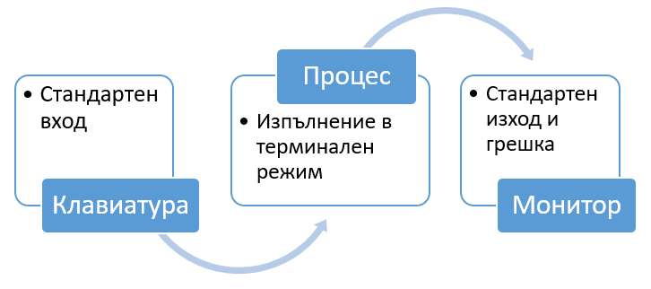

## Стандартни потоци

Всяка програма, която изпълняваме на командния ред, има автоматично три потока от данни:

| поток      | информация                                                                        |
|------------|-----------------------------------------------------------------------------------|
| STDIN (0)  | Стандартен вход (данни, подадени в програмата)                                    |
| STDOUT (1) | Стандартен изход (данни, отпечатани от програмата, по подразбиране към терминала) |
| STDERR (2) | "Стандартна грешка (за съобщения за грешки също е по подразбиране за терминала)   |
 
   

Полезна информация:
[Piping and Redirection! Keeping the data flowing](https://ryanstutorials.net/linuxtutorial/piping.php)

 