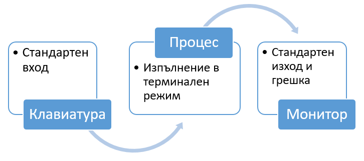

## Standart Streams

In general, computer programs receive input data (_keyboard, file, etc._), process it, and produce output results in the form of output data (_files, text, image, etc._). For standard console applications, the input data is entered via the computer's keyboard, and the output data is displayed on a text screen.

In this model of input and output of data, it is not known in advance how much and what type of data will be received from users and correspondingly output as a result. This type of input and output is called text **streams**.

Every program that we run in the command line in Linux is automatically connected to three streams of data:

| stream     | information                                                                    |
|------------|--------------------------------------------------------------------------------|
| STDIN (0)  | Standard input (data provided to the program, by default from the keyboard)    |
| STDOUT (1) | Standard output (data printed by the program, by default to the text terminal) |
| STDERR (2) | Standard error (for error messages, by default to the text terminal)           |

   

 
