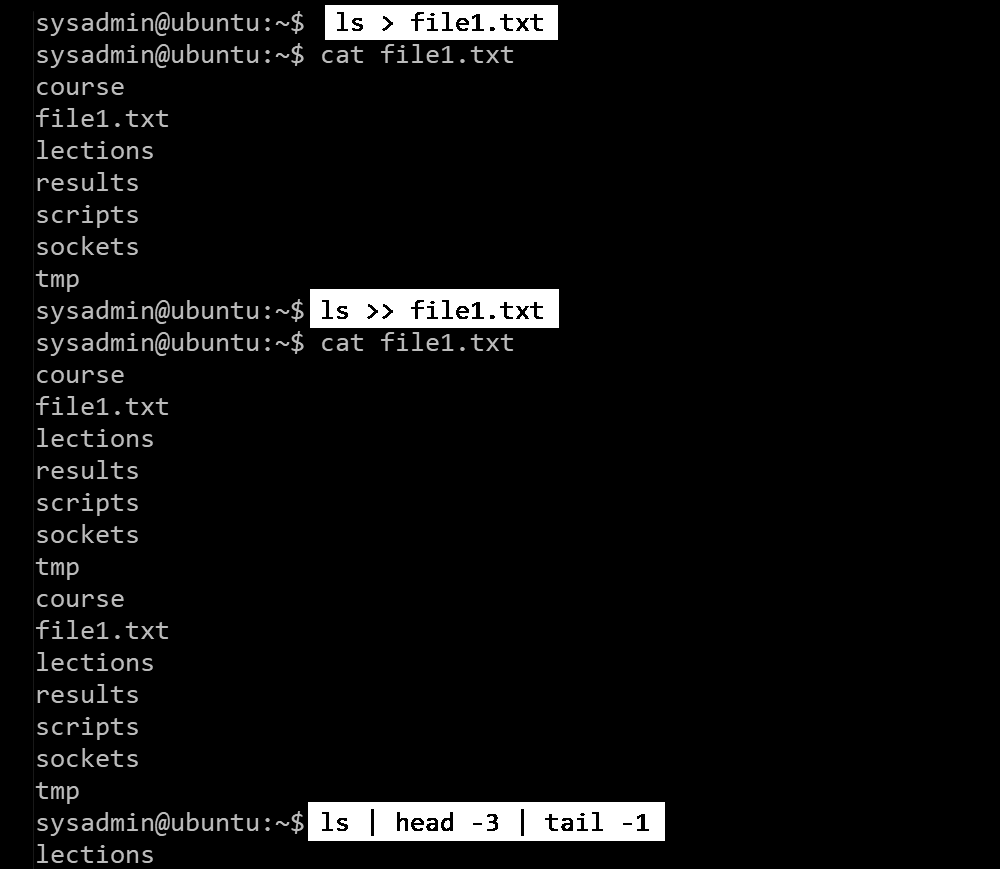

## Пренасочване и тръбопроводи

- Оператора по-голямо (**>**) пренасочва изхода на програмите към файл вместо да бъдат отпечатани на екрана. Ако запазваме файл, който вече съществува, съдържанието му ще бъде изтрито, и нова версия ще бъде запазена.
- Оператора двойно по-голямо (**>>**) пренасочва изхода и го добавя към файл.
- Тръбопроводният оператор (**|**) подава изхода на програмата отляво като вод на програмата отдясно.
 
 
 
Също така ще забележете, че файлът, който създадохме, също е в списъка. Първо се създава файлът и след това програмата се изпълнява и изходът се запазва във файла.