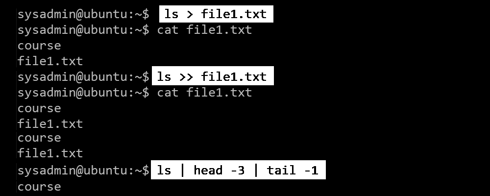

## Redirecting and Pipelines

Linux supports various tools for working with input-output streams, for example:

- The operator **greater than** ` > ` redirects the output of programs to a file instead of printing it on the screen. If the file already exists, its content will be deleted and a version with the new content will be saved.
- The operator **double greater than** ` >> ` redirects the output and appends it to a file if it already exists.
- The operator **pipe** ` | ` redirects the output of the program on the left as input to the program on the right.

 
 
In the above example, we create a text file **`file1.txt`**, which contains a list of the files in the current directory. Note that the file we created is also in the list. First, the file is created, then the command is executed and the output is saved in it.

Next, we add the listing of the current directory again to the same file.

In the third example, we output the list of files in the current directory, redirect it to the command **`head`**, which takes the first three lines, which are then redirected to the command **`tail`**, which keeps only the last line.