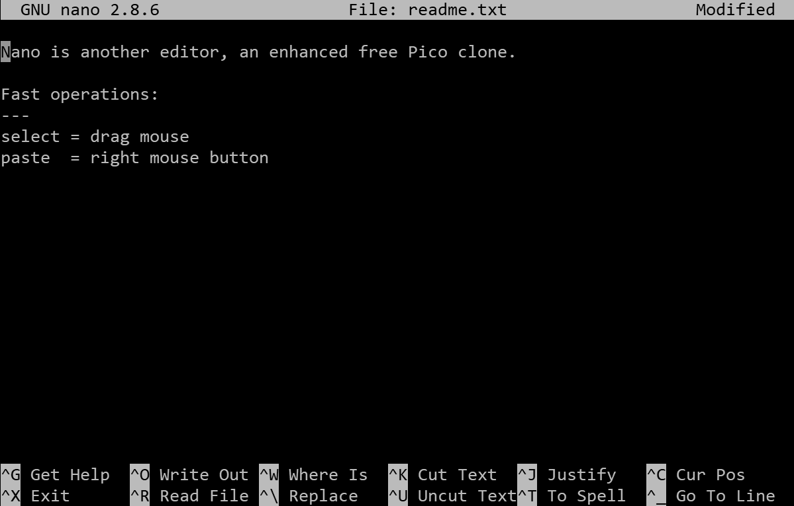

## Nano Text Editor

Text files are a commonly used means for storing and exchanging information in Linux. Because of this, almost every distribution offers tools to work with them. In our working environment, we will use the text editor **nano**:

Some of the main features of **nano** are:

### File Control

| Key             | Explanation                        |
| --------------- | ---------------------------------- |
| nano readme.txt | Opens or creates a file readme.txt |
| Ctrl-o Y Enter  | Saves the changes                  |
| Ctrl-r Alt-f    | Opens a new file                   |
| Alt->           | Switches to the next open file     |
| Alt-<           | Switches to the previous open file |
| Ctrl-x          | Exits the editor                   |

### Navigation in the Content

| Key    | Explanation                               |
| ------ | ----------------------------------------- |
| Ctrl-a | Move to the beginning of the current line |
| Ctrl-e | Move to the end of the current line       |
| Ctrl-v | Scroll down a page                        |
| Ctrl-y | Scroll up a page                          |
| Alt-   | Move to the beginning of the file         |
| Alt-/  | Move to the end of the file               |
| Alt-g  | Position to the desired line in the file  |

### Copying and Pasting

| Key          | Explanation                                                          |
| ------------ | -------------------------------------------------------------------- |
| Alt-a        | Select a block for copying or pasting                                |
| Alt-a Alt-^  | Copy (Copy) the selected block to the clipboard                      |
| Alt-a Ctrl-k | Cut (Cut) the selected block to the clipboard                        |
| Ctrl-k       | Cut (Cut) from the cursor position to the end of the line            |
| Ctrl-u       | Paste (Paste) the content from the clipboard at the current position |

### Search and Replace
| Key    | Description        |
| ------ | ------------------ |
| Ctrl-w | Search for text    |
| Alt-w  | Repeat last search |
| Alt-r  | Search and replace |

References:
- [The Beginner's Guide to Nano, the Linux Command-Line Text Editor](https://www.howtogeek.com/howto/42980/the-beginners-guide-to-nano-the-linux-command-line-text-editor/)
- [Nano text editor command cheatsheet](http://www.codexpedia.com/text-editor/nano-text-editor-command-cheatsheet/)
