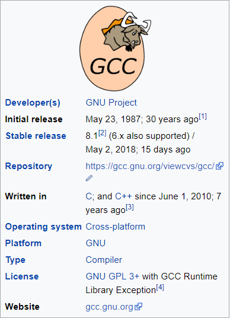

## Компилатор 

- Компилаторът GCC е разработен по проекта GNU и поддържа различни програмни езици.
- Първоначално е наречен GNU C Compiler, когато е работил само с програмния език C.
- Ще го използваме, за да направим нашите програми изпълними.

 

Повече информация: https://en.wikipedia.org/wiki/GNU_Compiler_Collection
