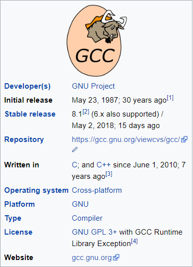

## Compiler 

- The GCC compiler was developed under the GNU project and supports various programming languages.
- It was originally called GNU C Compiler when it only worked with the C programming language.
- We will use it to make our programs executable.

 

Reference: 
[https://en.wikipedia.org/wiki/GNU_Compiler_Collection](https://en.wikipedia.org/wiki/GNU_Compiler_Collection)
