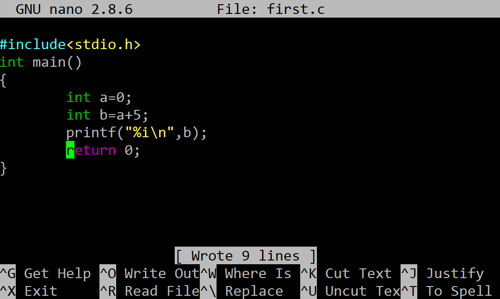

## Изходен програмен код

Използвайки текстовия редактор **nano** напишете изходния програмен код във файл **first.c**

```c
#include<stdio.h>
int main()
{
	int a=0;
	int b=a+5;
	printf("%i\n",b);
	return 0;
}
```

Изглед на изходния програмен код в текстовият редактор **nano**:

 
