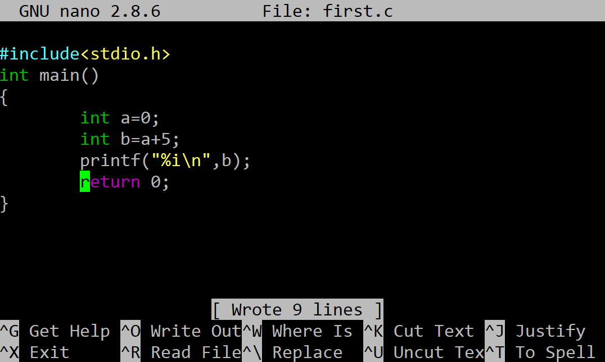

## Source Code

Using the text editor **nano**, write the source program code in the file **first.c**.

```c
#include<stdio.h>
int main()
{
	int a=0;
	int b=a+5;
	printf("%i\n",b);
	return 0;
}
```

View of the source code in the text editor **nano**:

 
