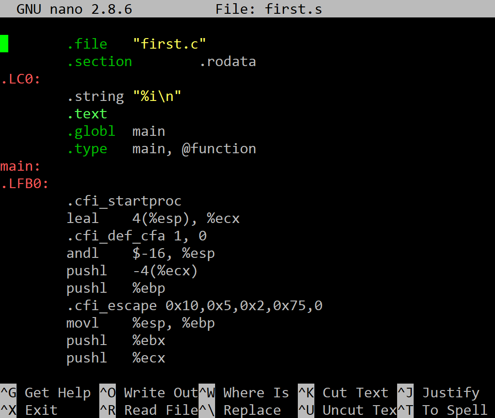

## Компилирайте в асемблер

Използвайки **gcc** компилирайте в асемблер, посредством следната команда:

```
gcc -S first.c
```

Резултатът се записва във файл **first.s**, който трябва да изглежда по следния начин:

 
