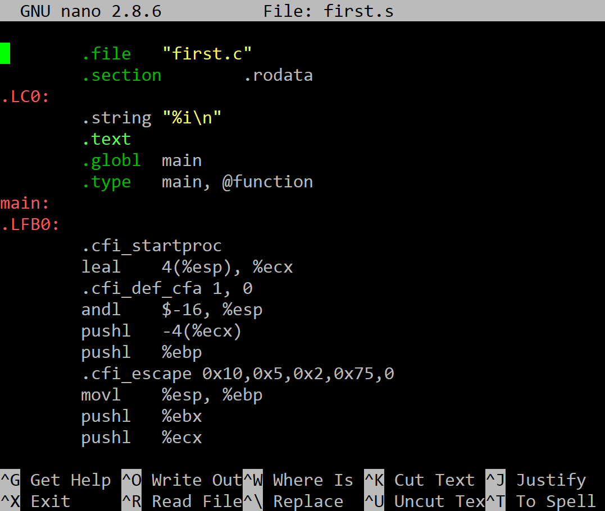

## Assembly

Using the **gcc** compiler, compile to **assembly** by executing the following command:

```
gcc -S first.c -o first.s
```

The result is saved in a file **first.s**, which should look like this:

 
