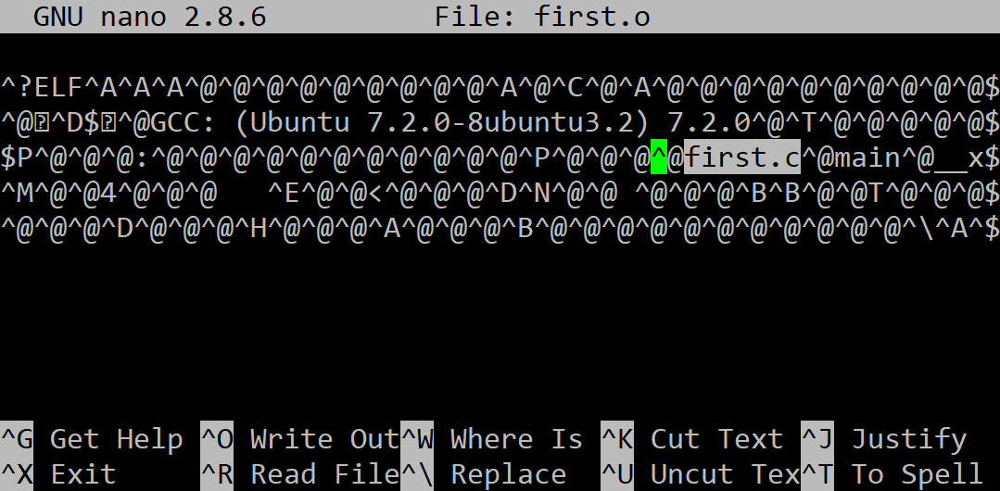

## Компилирайте до обектен файл

Използвайки gcc компилирайте до обектен файл, посредством следната команда:

```
gcc -c first.c -o first.o
```

Резултатът се записва във файл **first.о**, който трябва да изглежда по следния начин:

 
