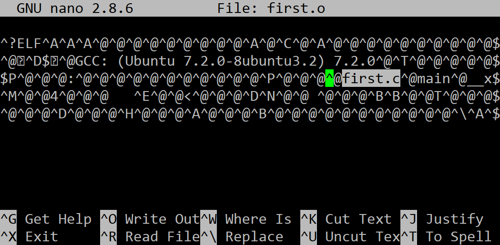

## Object

Using the **gcc** compiler, compile to an **object** file by executing the following command:

```
gcc -c first.c -o first.o
```

The result is saved in a file **first.o**, which should look like the following:

 
