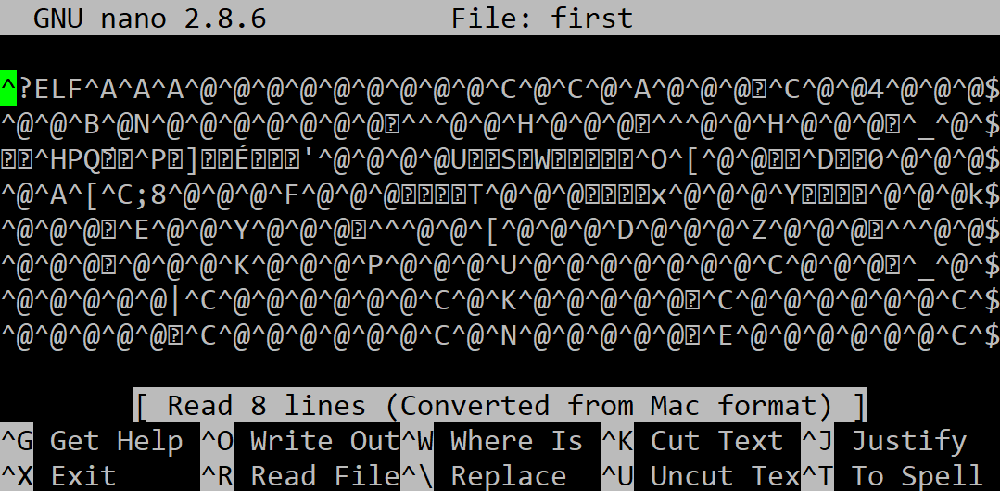

## Компилирайте до изпълнима програма

Използвайки компилатора **gcc** компилирайте до изпълнима програма **binary**, посредством изпълнението на следната командa:

```
gcc first.c -o first
```

Резултатът се записва във файл **first**, който трябва да изглежда по следния начин:

 
