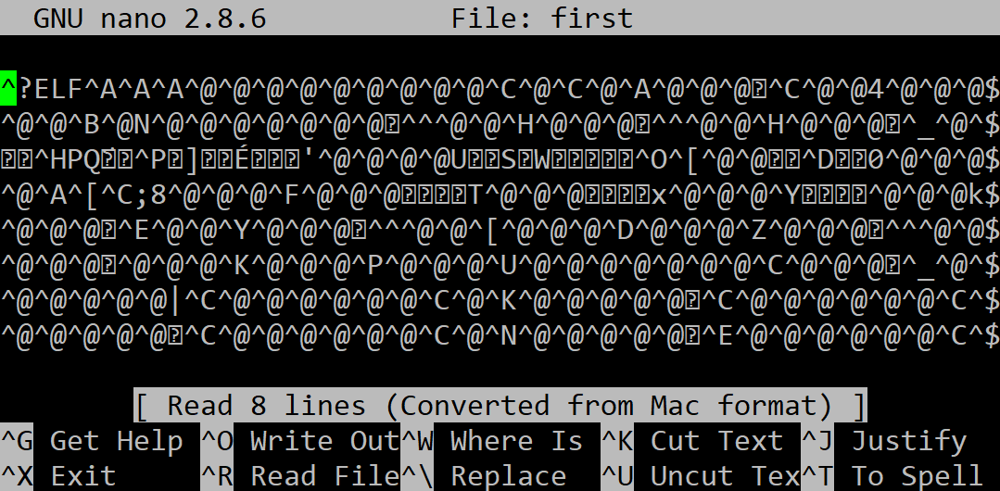

## Binary

Using the compiler **gcc**, compile to the executable program **binary** by executing the following command:

```
gcc first.c -o first
```

The result is recorded in a file **first**, which should look as follows:

 
