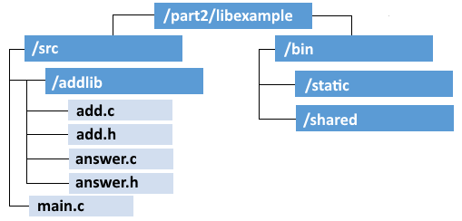

## Библиотеки

Библиотеките представляват множество компилирани обекти в един файл. 

Техните преимущества са: **повторно използване на компоненти** (използване на една споделена библиотека заема по-малко място на диска), **управление на версиите** (стари и нови версии съжителстват едновременно на една Linux система), **компонентна специализация** (разработчиците могат да  фокусират основната си компетентност в една библиотека).

Видовете библиотеки са: **статични** (обектен код в свързана библиотека, който става част от приложението) и **динамични** (споделени обекти, динамично свързвани по време на изпълнението).

### Примерна структура на библиотека

На фигурата по-долу е дадена примерна структура на една библиотека:

Полезна информация:
[Creating a shared and static library with the gnu compiler gcc]( https://renenyffenegger.ch/notes/development/languages/C-C-plus-plus/GCC/create-libraries/index)