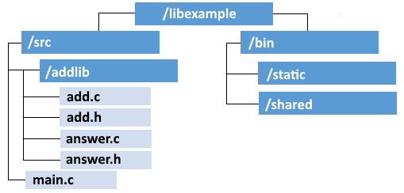

## Libraries

Libraries represent a collection of compiled objects in a single file.

Their advantages are: **reusability of components** (_using one shared library takes up less disk space_), **version management** (old and new versions coexist simultaneously on one Linux system), **component specialization** (_developers can focus their core competency in one library_).

The types of libraries are: **static** (_object code in a linked library, which becomes part of the application_) and **dynamic** (_shared objects, dynamically linked at runtime_).

### Structure of a library

The figure below shows a sample structure of a library:



### Directory Structure

Use the following commands to create the directory structure:
```
mkdir libexample
mkdir libexample/src
mkdir libexample/src/addlib
mkdir libexample/bin
mkdir libexample/bin/static
mkdir libexample/bin/shared
```
Reference:
[Creating a shared and static library with the gnu compiler gcc]( https://renenyffenegger.ch/notes/development/languages/C-C-plus-plus/GCC/create-libraries/index)

### Library files

In the folder `libexample/src/addlib/`, create a file `add.c` with the following content:
```c
#include <stdio.h>
int gSummand;
void setSummand(int summand) {
	gSummand = summand;
}
int add(int summand) {
	return gSummand + summand;
}
void __attribute__ ((constructor)) initLibrary(void) {
	printf("Library is initialized\n"); 
	gSummand = 0;
}
void __attribute__ ((destructor)) cleanUpLibrary(void) {
	printf("Library is exited\n"); 
}
```

In the folder `libexample/src/addlib/`, create a file `add.h` with the following content:
```c
void setSummand(int summand);
int add(int summand);
```

In the folder `libexample/src/addlib/`, create a file `answer.c` with the following content:
```c
#include "add.h"
int answer() {
	setSummand(20);
	return add(22); // 42 = 20 + 22
}
```

In the folder `libexample/src/addlib/`, create a file `answer.h` with the following content:
```c
int answer();
```

In the folder `libexample/src/`, create a file `main.c` with the following content:
```c
#include <stdio.h>
#include "addlib/add.h"
#include "addlib/answer.h"
int main(int argc, char* argv[])
{
	setSummand(5);
	printf("5 + 7 = %d\n", add(7));
	printf("And the answer is: %d\n", answer());
	return 0;
}
```
