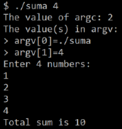

## Дебъгване
Преди да се запознаем съв възможностите за дебъгване да напишем кратка програма за намиране на сума на числа.

## Програма за намиране сума на числа
Инициализираме променливa **sum=0**. Отпечатваме стойността на **argc**. Отпечатваме стойностите в **argv**. Броят на числата **num_count** е втората стойност в **argv**. **num_count** на брой пъти четем число от клавиатурата и го добавяме към сумата.  Отпечатваме стойността на получената сума.
```
#include <stdio.h>
#include <stdlib.h>
int main(int argc, char* argv[]) 
{
  int numbers_count = 0, sum = 0;
  char temp_str[50];
  printf("The value of argc: %d\n", argc);
  printf("The value(s) in argv:\n");
  for(int i = 0; i < argc; i++) {
    printf("> argv[%d]=%s\n", i, argv[i]);
  }
  numbers_count = atoi(argv[1]);
  printf("Enter %d numbers:\n", numbers_count);
  for(int i = 0; i < numbers_count; i++) {
    scanf("%s", temp_str);
    sum += atoi(temp_str);
  }
  printf("Total sum is %d\n", sum);
}
```
 

### Дебъгване
За да компилирате изходния код на програмата с включена възможност за дебъгване:
```
gcc -g sum.c -о a.out
```

За да стартирате дебъгера:
```
gdb a.out
```

За да поставите точка на прекъсване, където програмата ще спре изпълнението:
```
b [function name, line number]
```

За да стартирате програмата:
```
r [command line arguments]
```

В таблицата са дадени съкратените клавишни комбинации полезни при работа с дебъгера:

| Клавиш       | Информация                                                                    |
| ------------ | ----------------------------------------------------------------------------- |
| h            | Помощ                                                                         |
| n            | Стъпка напред един блок код                                                   |
| s            | Стъпка напред един ред код                                                    |
| p [variable] | Отпечатва стойността на променливата variable                                 |
| info locals  | Отпечатва стойностите на всички локални променливи                            |
| bt           | Показва последователността на функциите, наречени до тази точка на изпълнение |
| q            | Изход                                                                         |

Повече информация: 
[Introduction to GDB](https://www.youtube.com/watch?v=sCtY--xRUyI) и [Harvard University CS50](https://www.youtube.com/watch?v=y5JmQItfFck)
