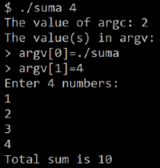

## Debugging

Before we get acquainted with the debugging possibilities, let's write a short program to find the sum of numbers: **suma.c**

### Summing Numbers
Initialize a variable **sum=0**. Print the value of **argc**. Print the values in **argv**. The numbers counter **num_count** is the second value in **argv**. Read a number from the keyboard **num_count** times and add it to the sum. Print the value of the obtained sum.

```c
#include <stdio.h>
#include <stdlib.h>
int main(int argc, char* argv[]) 
{
  int numbers_count = 0, sum = 0;
  char temp_str[50];
  printf("The value of argc: %d\n", argc);
  printf("The value(s) in argv:\n");
  for(int i = 0; i < argc; i++) {
    printf("> argv[%d]=%s\n", i, argv[i]);
  }
  numbers_count = atoi(argv[1]);
  printf("Enter %d numbers:\n", numbers_count);
  for(int i = 0; i < numbers_count; i++) {
    scanf("%s", temp_str);
    sum += atoi(temp_str);
  }
  printf("Total sum is %d\n", sum);
}
```
 

### Debugging 
To compile the source code of the program with debugging enabled:
```
gcc suma.c -о suma
```

To start the debugger:
```
gdb suma
```

To set a breakpoint where the program will stop execution:
```
b [function name, line number]
```

To start the program:
```
r [command line arguments]
```

The table provides the shortcut key combinations useful when working with the debugger:

| Key          | Information                                                       |
| ------------ | ----------------------------------------------------------------- |
| h            | Help                                                              |
| n            | Step forward one block of code                                    |
| s            | Step forward one line of code                                     |
| p [variable] | Prints the value of the variable variable                         |
| info locals  | Prints the values of all local variables                          |
| bt           | Shows the sequence of functions called up to this execution point |
| q            | Exit                                                              |

Reference: [Introduction to GDB](https://www.youtube.com/watch?v=sCtY--xRUyI) и [Harvard University CS50](https://www.youtube.com/watch?v=y5JmQItfFck)
