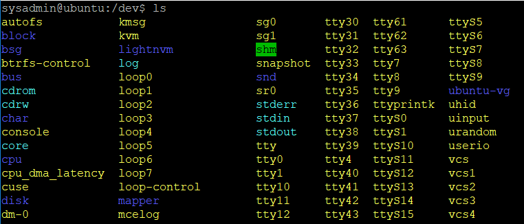
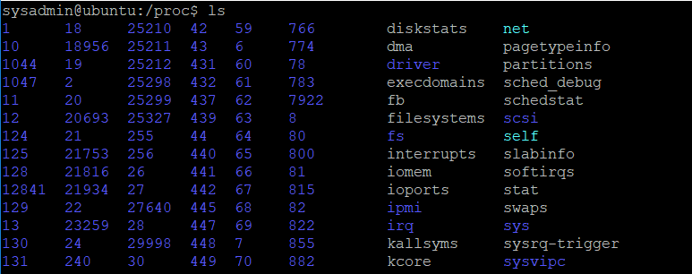

## File Systems and Namespaces

Linux provides a global and unified namespace of files and directories with root /. 
A file system is a collection of files and directories in a formal and valid hierarchy. 
File systems can be added (mounted) separately and removed (unmounted) from the global namespace of files and directories. 
Some directories are special, for example **/dev** and **/proc**.

 

 
 
The directory structure in Linux is defined by a standard that can be found at 
[http://www.pathname.com/fhs/](http://www.pathname.com/fhs/).
