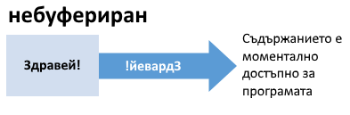
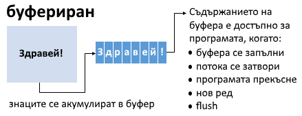

## Buffered vs Unbuffered Streams

A stream represents the transmission of data from one side to another. A file represents a place for storing data on disk. A file uses streams to store and load data. A buffer is used temporarily to store data from the stream.

Characters written to or read from an **unbuffered stream** are transmitted individually to or from the file as soon as possible. Characters written to or read from a **fully buffered stream** are transmitted to or from the file in blocks of arbitrary size. Characters written to a **line buffered stream** are transmitted to the file in blocks when a new line appears.

### Low-Level File Operations - Unbuffered Stream
The methods **open()**, **read()**, **write()**, **lseek()** are part of the **unistd.h** library. They work with the file descriptor **(INT)** and treat the input/output stream as binary data.

 

### Low-Level File Operations - Buffered Stream
The methods **fopen()**, **fread()**, **fwrite()**, **fseek()** are part of the **stdio.h** library. They use the **FILE** object type and treat the input/output stream as text. Read/write operations on the accumulated buffer can be forced using the **fflush()** method.

 
