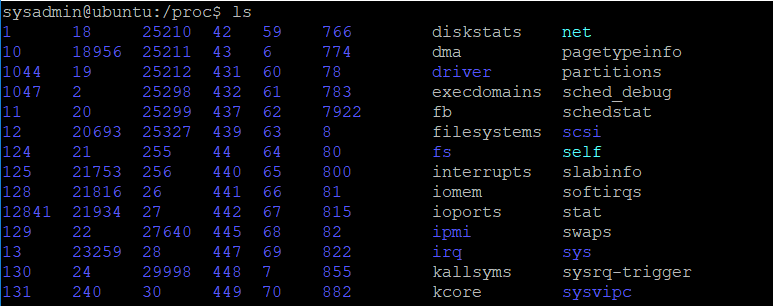

## Файлови системи и именовани пространства

Linux осигурява глобално и единно пространство от имена на файлове и директории с корен /. Файлова система е колекция от файлове и директории в официална и валидна йерархия. Файловите системи могат да бъдат добавени (монтирани) поотделно и премахнати (демонтирани) от глобалното пространство на имената на файлове и директории. Някои директории са специални, например **/dev** и **/proc**.

 

 
 
Структурата на директориите в Линукс е дефинирана със стандарт, който може да бъде намерен на http://www.pathname.com/fhs/.
