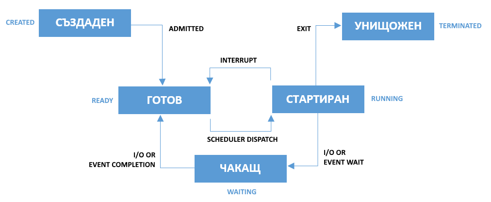

## Processes 

- Processes are object code in execution: active, alive, running programs.
- Processes consist of data (**data**), resources (**resources**), state (**state**), and a virtualized computer (**virtualized computer**).
- Each process is represented by a unique process identifier (**pid**).
- The process that the kernel starts when there are no other executable processes is the idle process (**idle process**), its identifier is **pid = 0**.
- The process that creates a new process is known as the parent (**parent**), and the new process is known as the child (**child**).
- Each process is owned by a user (**user**) and a group (**group**).

The possible states of a process are shown in the figure below:

### Note:

> If files are the most fundamental abstraction in a Unix system, processes are the second most fundamental. Processes are object code in execution: active, alive, running programs. But they're more than just object code—processes consist of data, resources, state, and a virtualized computer.
>
> Processes begin life as executable object code, which is machine-runnable code in an executable format that the kernel understands (the format most common in Linux is ELF). The executable format contains metadata, and multiple sections of code and data. Sections are linear chunks of the object code that load into linear chunks of memory. All bytes in a section are treated the same, given the same permissions, and generally used for similar purposes. 
>
> The most important and common sections are the text section, the data section, and the bss section. The text section contains executable code and read-only data, such as constant variables, and is typically marked read-only and executable. The data section contains initialized data, such as C variables with defined values, and is typically marked readable and writable. The bss section contains uninitialized global data. Because the C standard dictates default values for C variables that are essentially all zeros, there is no need to store the zeros in the object code on disk. Instead, the object code can simply list the uninitialized variables in the bss section, and the kernel can map the zero page (a page of all zeros) over the section when it is loaded into memory. The bss section was conceived solely as an optimization for this purpose. The name is a historic relic; it stands for block started by symbol, or block storage segment. Other common sections in ELF executables are the absolute section (which contains nonrelocatable symbols) and the undefined section (a catchall).
>
> A process is also associated with various system resources, which are arbitrated and managed by the kernel. Processes typically request and manipulate resources only through system calls.
> 
> Resources include timers, pending signals, open files, network connections, hardware, and IPC mechanisms. A process' resources, along with data and statistics related to the process, are stored inside the kernel in the process' process descriptor.
>
> A process is a virtualization abstraction. The Linux kernel, supporting both preemptive multitasking and virtual memory, provides a process both a virtualized processor, and a virtualized view of memory. From the process' perspective, the view of the system is as though it alone were in control. That is, even though a given process may be scheduled alongside many other processes, it runs as though it has sole control of the system. The kernel seamlessly and transparently preempts and reschedules processes, sharing the system's processors among all running processes. Processes never know the difference.
> 
> Similarly, each process is afforded a single linear address space, as if it alone were in control of all of the memory in the system. Through virtual memory and paging, the kernel allows many processes to coexist on the system, each operating in a different address space. The kernel manages this virtualization through hardware support provided by modern processors, allowing the operating system to concurrently manage the state of multiple independent processes.
