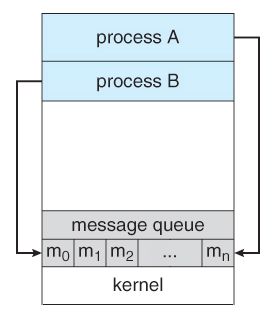

## Message Queue

Message queues can be described as an internal linked list in the kernel's address space. Messages can be sent to the queue and retrieved from the queue in several different ways. Each message queue is uniquely identified by an IPC identifier.

More information: [Message Queues](https://www.tldp.org/LDP/lpg/node27.html)