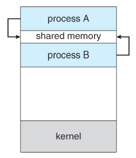

## Shared Memory

Shared memory can be described as mapping a region (segment) of memory that will be mapped and shared by more than one process. This is the fastest form of inter-process communication (**IPC**) because there is no intermediation - information is transferred directly from a memory segment into the address space of the calling process. The segment can be created by one process and then written to and read by any number of processes.
 

More information: [Shared Memory](https://www.tldp.org/LDP/lpg/node65.html)