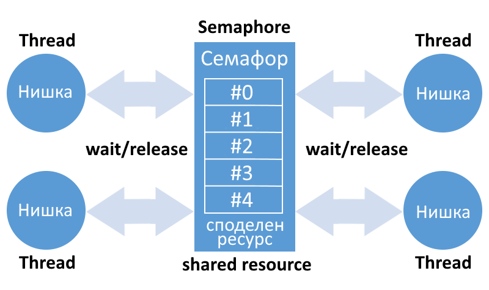

## Semaphore

Semaphores are counters used to control access to shared resources by multiple processes (resource counters). They are used as a locking mechanism to prevent processes from accessing a specific resource while another process is performing operations on it. The resource counter decreases when a process starts using a resource and increases back when the resource is released. When the counter = 0, the resource is currently unavailable.

More information: [Semaphores](https://www.tldp.org/LDP/lpg/node46.html)