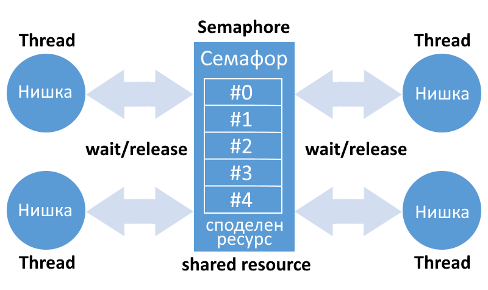

## Семафор

Семафорите са броячи, използвани за контрол на достъпа до споделени ресурси от множество процеси (броячи на ресурси). Използват се като блокиращ механизъм, за да се предотврати достъпът на процесите до конкретен ресурс, докато друг процес извършва операции с него. Броячът на ресурси намалява, когато процесът започне да използва ресурс и се увеличава обратно, когато ресурсът се освободи. Когато броячът = 0, ресурсът в момента не е налице.

Повече информация: [Semaphores](https://www.tldp.org/LDP/lpg/node46.html)