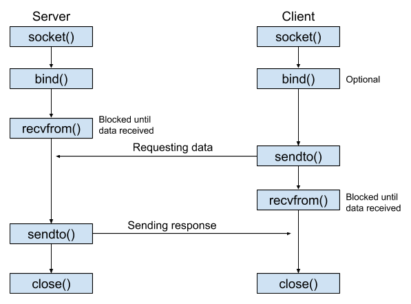
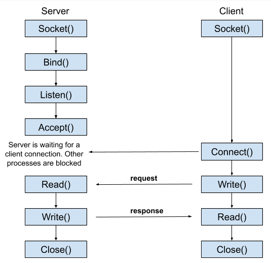

## Сокетите в Линукс

Повечето комуникации между процесите използват модела клиент-сървър. Един от двата процеса, наречен **клиент** (_Термин на Английски език: client_), се свързва с другия процес наречен **сървър** (_Термин на Английски език: server_), обикновено с искане за информация. Всяка страна на тази вдупосочна комуникация може да бъде представена чрез **сокет** (_Термин на Английски език: socket_). Процесите клиент и сървър създават техен собствен сокет.

### Видове сокети

**Unix domain socket** е крайна точка за обмен на данни между процеси, изпълняващи една и съща хостова операционна система.

**Network socket** е крайна точка за изпращане или получаване на данни в рамките на хост от компютърната мрежа.

### Типове мрежови сокети
Сокетите поддържат предаването на надежден **поток** (_Термин на Английски език: stream_) от байтове, 
както и подредено и ненадеждно предаване на **дейтаграми** (_Термин на Английски език: datagrams_).
Поточните сокети разглеждат комуникациите като непрекъснат поток от символи, 
докато Дейтаграм сокетите трябва да четат целите съобщения наведнъж.

### Kомуникация посредством Дейтаграм сокет

 

### Kомуникация посредством Поточен сокет

 
