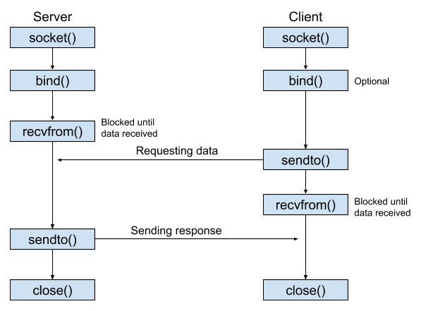

## Sockets in Linux

Most inter-process communications use the client-server model. One of the two processes, called the **client**, connects to the other process called the **server**, typically with a request for information. Each side of this bidirectional communication can be represented by a **socket**. The client and server processes create their own socket.

### Socket Types

**Unix domain socket** is an endpoint for exchanging data between processes executing on the same host operating system.

**Network socket** is an endpoint for sending or receiving data within a host from a computer network.

### Network Socket Types
Sockets support the transmission of reliable **streams** of bytes, 
as well as ordered and unreliable transmission of **datagrams**.
Stream sockets view communications as a continuous stream of characters, 
while Datagram sockets must read entire messages at once.

### Communication via Datagram Socket

 

### Communication via Stream Socket

 
