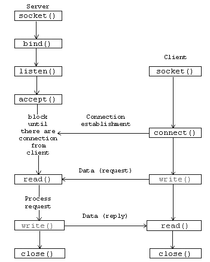

## Мрежови сокети

```c
#include <sys/types.h>
#include <sys/socket.h>
#include <netdb.h>
extern int h_errno;

struct hostent *gethostbyname(const char *name);
uint16_t htons(uint16_t hostshort);
int listen(int sockfd, int backlog);
int accept(int sockfd, struct sockaddr *addr, socklen_t *addrlen);
int connect(int sockfd, const struct sockaddr *addr, socklen_t addrlen);
```

За да приемете връзките, се изпълняват следните стъпки:

1. Създава се сокет чрез **socket()**.
2. Сокета се свързва с локален адрес с помощта на **bind()**, така че другите сокети да могат да се свързват **connect()** с него.
3. Желанието за приемане на входящи връзки и ограничение броя на входящите връзки се определят от **listen()**.
4. Връзките се приемат с **accept()**.

 