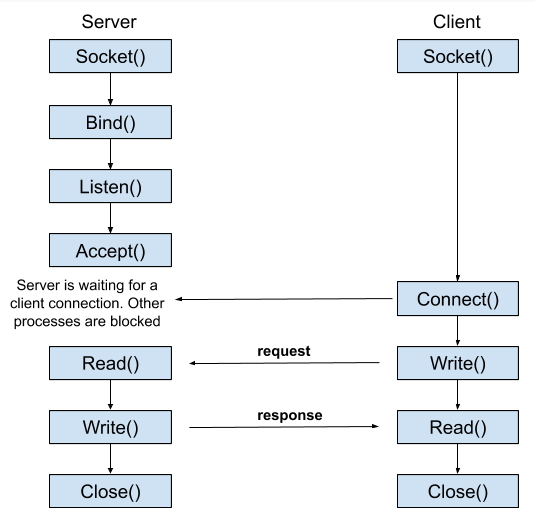

## Network Sockets

```c
#include <sys/types.h>
#include <sys/socket.h>
#include <netdb.h>
extern int h_errno;

struct hostent *gethostbyname(const char *name);
uint16_t htons(uint16_t hostshort);
int listen(int sockfd, int backlog);
int accept(int sockfd, struct sockaddr *addr, socklen_t *addrlen);
int connect(int sockfd, const struct sockaddr *addr, socklen_t addrlen);
```

To accept connections, the following steps are performed:

1. A socket is created with **socket()**.
2. The socket is bound to a local address using **bind()**, so that other sockets can **connect()** to it.
3. The willingness to accept incoming connections and a queue limit for incoming connections are specified with **listen()**.
4. Connections are accepted with **accept()**.

 