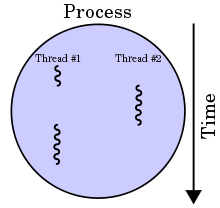

## Нишки

A **thread** in computer science is short for a thread of execution. Threads are a way for a program to divide (termed "split") itself into two or more simultaneously (or pseudo-simultaneously) running tasks. 

Threads and processes differ from one operating system to another but, in general, a thread is contained inside a process and different threads in the same process share same resources while different processes in the same multitasking operating system do not. 

Threads are lightweight, in terms of the system resources they consume, as compared with processes.

 
