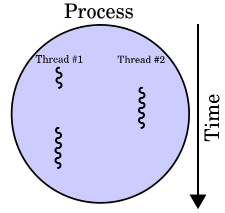

## Introduction to Threads

**Thread** in computer science is short for thread of execution. 
Threads are a way for a program to split itself into two or more simultaneously or pseudo-simultaneously running tasks.

Threads and processes differ on different operating systems, 
but in general a thread is contained inside a process and different threads in the same process share the same resources, 
while different processes in the same multitasking operating system do not.

Threads consume fewer system resources compared to processes.

 

_Image source: [Wikipedia](https://commons.wikimedia.org/wiki/File:Multithreaded_process.svg)_
