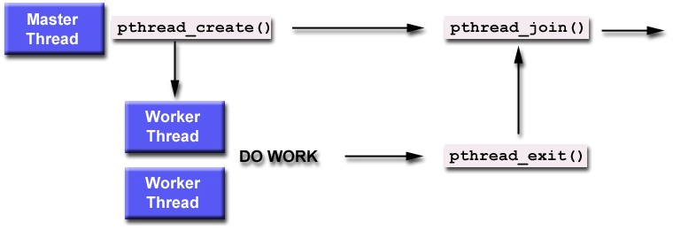

## Joining threads

 

The **pthread_join()** subroutine blocks the calling thread until the specified **threadid** thread terminates.

The programmer is able to obtain the target thread's termination return status if it was specified in the target thread's call to** pthread_exit()**.

