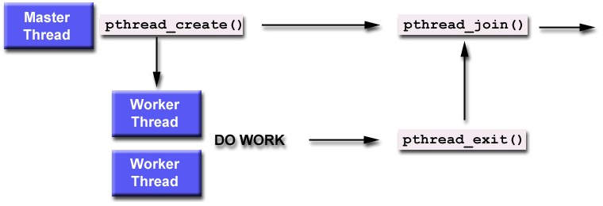

## Joining Threads

 

**pthread_join()** blocks the calling thread until the thread with identifier **threadid** terminates.

The programmer can obtain the termination status of the thread if indicated by a call to **pthread_exit()**.