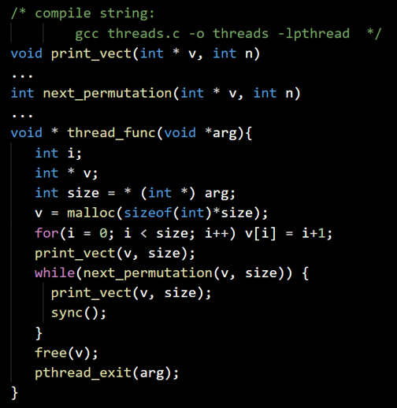

## Joining two Threads

- Define the helper permutations generation functions 
- Define the threads function
- Allocate a vector of size **arg**
- Initialize the vector with the first permutation and print it
- While there is next permutation:
- Generate it, print it and synchronize
- Deallocate the vector and exit thread

 

- In the main function function:
- Start thread function with size 4, exit on error
- Start thread function with size 3, exit on error
- Wait for the first thread and print a notification, exit on error
- Wait for the second thread and print a notification, exit on error
- Print **Job Done!** and quit

 

### threads-join.c
```
#include<stdio.h>
#include<stdlib.h>
#include<unistd.h>
#include<pthread.h>
// Print
void print(int *v, int n)
{
  for(int i=0;i<n;i++)
  printf("%i", v[i]);
  printf("\n");
}
// Swap
void swap(int *i, int *j)
{
  int temp = *i;
  *i = *j;
  *j = temp;
}
// Reverse
void reverse(int *v, int n)
{
   for(int i=0;i<(n/2); i++)
   swap(&v[i], &v[n-1-i]);
}
// Permute
int permute(int *v, int n)
{
  int i = n-1, j;
  while((i > 1) && (v[1] < v[i-1])) i--;
  if(v[i] > v[i-1])
  {
    j = n - 1;
    while(v[j] < v[i-1]) j--;
    swap(&v[j], &v[i-1]);
    reverse(&v[i], n-1);
    return 1;
  }
  return 0;
}
// Threads Function
void * func(void *arg)
{
  int i;
  int n = *(int*)arg; // n = 3 or 4
  int *v = malloc(sizeof(int)*n); // v[n]
  for(i=0;i<n;i++) v[i] = i+1; // 1,2 ... n
  print(v,n); // 123 or 1234
  while(permute(v,n) != 0)
  {
    print(v,n);
    sync();
  }
  free(v);
  pthread_exit(arg);
}
// Main
int main(int argc, char *argv)
{
   void *ret;
   int result;
   pthread_t thread1, thread2;

   // thread one
   int n1 = 4;
   result = pthread_create(&thread1,NULL,func,&n1);
   if(result != 0)
   {
      printf("Error Creating Thread One!\n");
      return EXIT_FAILURE; // return -1;
   }

   // tread two
   int n2 = 3;
   result = pthread_create(&thread2,NULL,func,&n2);
   if(result != 0)
   {
      printf("Error Creating Thread Two!\n");
      return EXIT_FAILURE; // return -1;
   }

   // thread one result
   result = pthread_join(thread1, &ret);
   if(result != 0)
   {
     printf("Error Joining Thread One!\n");
     return EXIT_FAILURE; // return -1;
   }
   printf("Thread one finished with result: %i\n", *(int*)ret);

   // thread two result
   result = pthread_join(thread2, &ret);
   if(result != 0)
   {
     printf("Error Joining Thread Two!\n");
     return EXIT_FAILURE; // return -1;
   }
   printf("Thread two finished with result: %i\n", *(int*)ret);

   // Job Done
   printf("Job Done!\n");

   return EXIT_SUCCESS; // return 0
}
```

Compile with support for threads:
```
gcc threads-join.c -o threads-join -lpthread
```
