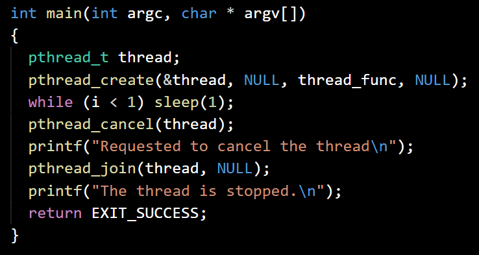
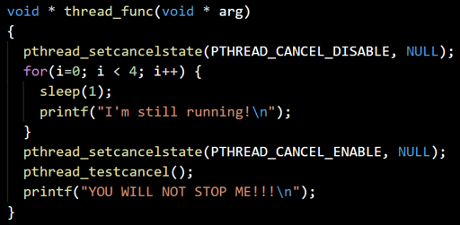

## Thread cancellations

- Create a thread
- Try to cancel it
- Wait for it to finish

 

- Mark the thread as uncancellable
- ... while it’s working
- ... and until we enable cancellations
- ... AND reach a cancelability point

 

- Make the thread cancellable at any time
- But mark it in a noncancelable state for now
- ... while it’s working
- ... and until we enable cancellations
- The thread gets cancelled automatically, no need to reach a cancellation point


### threads-cancel.c
```
#include<stdio.h>
#include<stdlib.h>
#include<unistd.h>
#include<pthread.h>
int i;
void * thread_func(void * arg)
{
  pthread_setcanceltype(PTHREAD_CANCEL_ASYNCHRONOUS, NULL);
  pthread_setcancelstate(PTHREAD_CANCEL_DISABLE, NULL);
  for(i=0; i<4; i++)
  {
     sleep(1);
     printf("I am running verry important process %i ...\n", i+1);
  }
  pthread_setcancelstate(PTHREAD_CANCEL_ENABLE, NULL);
  pthread_testcancel();
  printf("YOU WILL NOT STOP ME!!!\n");
}
int main(int argc, char * argv[])
{
  pthread_t thread;
  pthread_create(&thread, NULL, thread_func, NULL);
  while(i < 1) sleep(1);
  pthread_cancel(thread);
  printf("Requsted to cancel the thread!\n");
  pthread_join(thread, NULL);
  printf("The thread is stopped!\n");
  return EXIT_SUCCESS; // 0
}
```

Compile with support for threads:
```
gcc threads-cancel.c -o threads-cancel -lpthread
```
