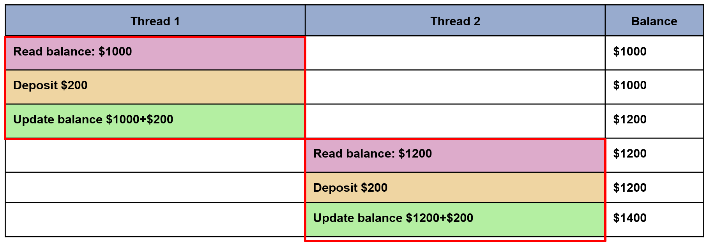

## Кога е необходимо заключване?

 

В горния пример трябва да се използва мютекс за заключване на баланса (_Променлива: balance_), докато нишката използва този споделен ресурс от данни.

 

В горния пример нишка 1 заключва ресурса за баланс (_Променлива: balance_) и нишка 2 е блокирана, докато мютексът не бъде освободен.