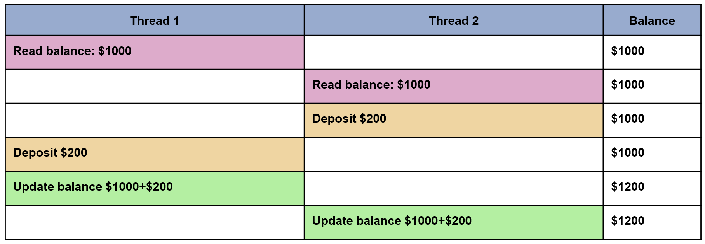
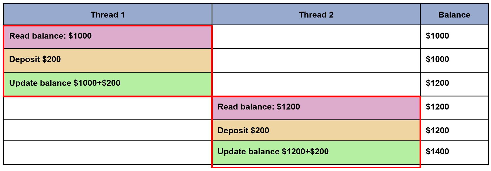

## When to lock?

In the example above a mutex should be used to protect the `balance` variable while a thread uses this shared data resource.

In the example above thread 1 locks the `balance` resource and thread 2 is blocked until the mutex is released.
