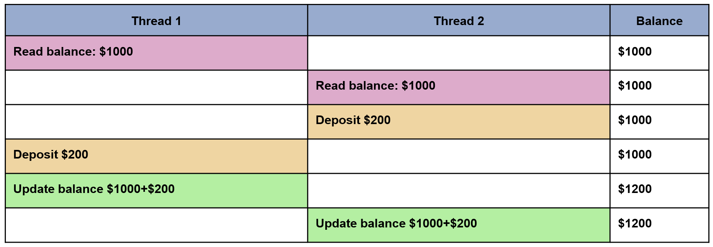

## Mutex example

 

In the above example, a mutex should be used to lock the "Balance" while a thread is using this shared data resource.

 

In the above example, thread 1 locks the balance resource and thread 2 is blocked until the mutex is released.

